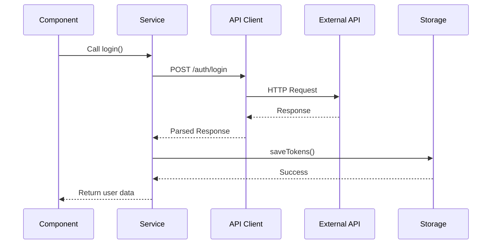

# Project Architecture Documentation

## 📁 Folder Structure (Next.js 15+ Standard)

```
src/
├── app/                        # Next.js App Router
│   ├── api/                   # ✅ API Routes (Standard Next.js)
│   │   ├── auth/             # Authentication endpoints
│   │   ├── dashboard/        # Dashboard endpoints
│   │   ├── monitoring/       # Monitoring endpoints
│   │   └── stories/          # Stories endpoints
│   ├── dashboard/            # Dashboard pages
│   ├── page.js              # Login page
│   └── layout.js            # Root layout
│
├── lib/                       # Core utilities
│   ├── apiClient.js          # Centralized API client
│   ├── storage.js            # Storage management
│   ├── auth.js               # Auth utilities
│   └── utils.js              # Helper functions
│
├── constants/                 # Application constants
│   └── apiEndpoints.js       # API endpoint definitions
│
├── services/                  # Business logic layer
│   ├── impactLeadersAuthService.js
│   ├── postsService.js
│   ├── usersService.js
│   └── ...
│
├── components/               # React components
│   ├── core/                # Layout components
│   ├── dashboard/           # Dashboard components
│   ├── posts/               # Posts components
│   └── ui/                  # UI components
│
└── hooks/                    # Custom React hooks
    ├── useApi.js
    └── useAuth.js
```

## 🔄 API Routes (Next.js Standard)

All API routes now follow Next.js standard structure:
- ✅ `/api/auth/login` - Authentication
- ✅ `/api/dashboard/stats` - Dashboard data
- ✅ `/api/monitoring/system` - System monitoring
- ✅ `/api/stories` - Stories CRUD

## 🏗️ Architecture Layers

### 1. **API Client Layer** (`src/lib/apiClient.js`)

Centralized HTTP client with:
- ✅ Automatic token injection
- ✅ Request/Response interceptors
- ✅ Error handling
- ✅ Retry logic
- ✅ Timeout management
- ✅ FormData support

**Usage:**
```javascript
import { apiClient } from '@/lib/apiClient';

// GET request
const response = await apiClient.get('/users', {
  params: { page: 1, limit: 10 }
});

// POST request
const response = await apiClient.post('/posts', {
  title: 'Hello',
  content: 'World'
});

// File upload
const formData = new FormData();
formData.append('image', file);
const response = await apiClient.upload('/posts/upload', formData);

// Skip auth for public endpoints
const response = await apiClient.post('/auth/login', data, {
  skipAuth: true
});
```

### 2. **Storage Layer** (`src/lib/storage.js`)

Type-safe storage management with:
- ✅ localStorage/sessionStorage support
- ✅ Automatic JSON serialization
- ✅ Expiration support
- ✅ Error handling
- ✅ SSR compatibility

**Usage:**
```javascript
import { localStorage, authStorage, cacheStorage } from '@/lib/storage';

// Basic storage
localStorage.set('key', { data: 'value' });
const data = localStorage.get('key', defaultValue);

// With expiration
localStorage.set('key', data, { expiresIn: 5 * 60 * 1000 }); // 5 minutes

// Auth storage helpers
authStorage.saveTokens({ accessToken, refreshToken, user });
const isAuth = authStorage.isAuthenticated();
authStorage.clearTokens();

// Cache storage
cacheStorage.set('users', usersData, 5 * 60 * 1000); // 5 min cache
const cachedUsers = cacheStorage.get('users');
```

### 3. **Constants Layer** (`src/constants/apiEndpoints.js`)

Centralized API endpoint definitions:

**Usage:**
```javascript
import { AUTH, POSTS, USERS, ADMIN } from '@/constants/apiEndpoints';

// Use predefined endpoints
apiClient.get(AUTH.ME);
apiClient.post(POSTS.UPVOTE(postId), {});
apiClient.get(USERS.BY_ID(userId));

// Dynamic endpoints
POSTS.COMMENTS(postId)           // => /posts/{id}/comments
USERS.FOLLOW(userId)             // => /users/{id}/follow
ADMIN.POSTS.PIN(postId)          // => /admin/posts/{id}/pin
```

### 4. **Service Layer** (`src/services/`)

Business logic with clean API:

**Example Service:**
```javascript
import { apiClient } from '@/lib/apiClient';
import { authStorage } from '@/lib/storage';
import { AUTH } from '@/constants/apiEndpoints';

export class AuthService {
  static async login(email, password) {
    const response = await apiClient.post(AUTH.LOGIN,
      { email, password },
      { skipAuth: true }
    );

    if (!response.success) {
      return {
        success: false,
        message: response.message
      };
    }

    const apiData = response.data.data || response.data;
    authStorage.saveTokens({
      accessToken: apiData.accessToken,
      refreshToken: apiData.refreshToken,
      user: apiData.user
    });

    return {
      success: true,
      user: apiData.user
    };
  }
}
```

## 🔐 Authentication Flow



### Token Management

1. **Initial Setup:**
```javascript
// In impactLeadersAuthService.js
import { apiClient } from '@/lib/apiClient';
import { authStorage } from '@/lib/storage';

// Set token getter for automatic injection
apiClient.setTokenGetter(() => authStorage.getAccessToken());
```

2. **Automatic Token Injection:**
- All API requests automatically include the token
- No need to manually pass tokens
- Use `skipAuth: true` for public endpoints

3. **Token Refresh:**
```javascript
static async refreshToken() {
  const tokens = authStorage.getTokens();
  const response = await apiClient.post(AUTH.REFRESH,
    { refreshToken: tokens.refreshToken },
    { skipAuth: true }
  );

  if (response.success) {
    const newTokens = {
      accessToken: response.data.accessToken,
      refreshToken: response.data.refreshToken || tokens.refreshToken,
      user: tokens.user
    };
    authStorage.saveTokens(newTokens);
  }
}
```

## 📝 Best Practices

### 1. **Service Methods**

✅ **DO:**
```javascript
static async getPosts(params = {}) {
  try {
    const response = await apiClient.get(POSTS.BASE, { params });
    return {
      success: response.success,
      data: response.data,
      message: response.message
    };
  } catch (error) {
    console.error('[Posts] Get posts error:', error);
    return {
      success: false,
      message: error.message
    };
  }
}
```

❌ **DON'T:**
```javascript
// Don't throw errors, return structured responses
static async getPosts(params = {}) {
  const response = await apiClient.get('/posts?' + buildQuery(params));
  if (!response.ok) throw new Error('Failed');
  return response.json();
}
```

### 2. **Error Handling**

```javascript
// API Client handles errors, services return structured responses
const result = await PostsService.getAllPosts({ page: 1 });

if (result.success) {
  // Handle success
  setPosts(result.data);
} else {
  // Handle error
  showError(result.message);
}
```

### 3. **Storage Usage**

```javascript
// Use specific storage helpers
authStorage.saveTokens(tokens);           // For auth tokens
cacheStorage.set('key', data, ttl);       // For cached data
localStorage.set('settings', settings);   // For app settings
```

### 4. **Endpoint Constants**

```javascript
// Use constants, not hardcoded strings
✅ apiClient.get(POSTS.BY_ID(postId))
❌ apiClient.get(`/posts/${postId}`)

✅ apiClient.post(AUTH.OTP.VERIFY, data)
❌ apiClient.post('/auth/otp/verify', data)
```

## 🚀 Migration Guide

### Migrating Old Service to New Structure

**Before:**
```javascript
import { ExternalApiService } from './externalApiService';

export class OldService {
  static async getData() {
    const token = localStorage.getItem('token');
    const response = await ExternalApiService.get('/data', token);
    return response;
  }
}
```

**After:**
```javascript
import { apiClient } from '@/lib/apiClient';
import { DATA } from '@/constants/apiEndpoints';

export class NewService {
  static async getData() {
    try {
      const response = await apiClient.get(DATA.BASE);
      return {
        success: response.success,
        data: response.data,
        message: response.message
      };
    } catch (error) {
      console.error('[Service] Get data error:', error);
      return {
        success: false,
        message: error.message
      };
    }
  }
}
```

## 📊 Benefits of New Architecture

1. **Separation of Concerns**
   - API logic → `apiClient.js`
   - Storage logic → `storage.js`
   - Business logic → `services/`
   - Constants → `constants/`

2. **Maintainability**
   - Single source of truth for endpoints
   - Centralized error handling
   - Consistent response structure

3. **Type Safety & DX**
   - Autocomplete for endpoints
   - Clear error messages
   - Structured responses

4. **Performance**
   - Request deduplication
   - Built-in caching
   - Retry logic

5. **Security**
   - Automatic token management
   - Secure storage helpers
   - Token expiration handling

## 🔧 Configuration

### Environment Variables

```env
NEXT_PUBLIC_API_BASE_URL=https://api.example.com
```

### API Client Settings

```javascript
// In apiClient.js
this.defaultTimeout = 30000;  // 30 seconds
this.retries = 2;              // Retry failed requests
```

### Storage Keys

All storage keys are centralized in `storage.js`:
```javascript
export const STORAGE_KEYS = {
  AUTH_TOKEN: 'auth_token',
  IMPACT_LEADERS_AUTH: 'impactLeadersAuth',
  USER_PREFERENCES: 'user_preferences',
  // ... etc
};
```

## 📚 Additional Resources

- API Client: `src/lib/apiClient.js`
- Storage: `src/lib/storage.js`
- Endpoints: `src/constants/apiEndpoints.js`
- Example Service: `src/services/impactLeadersAuthService.js`
